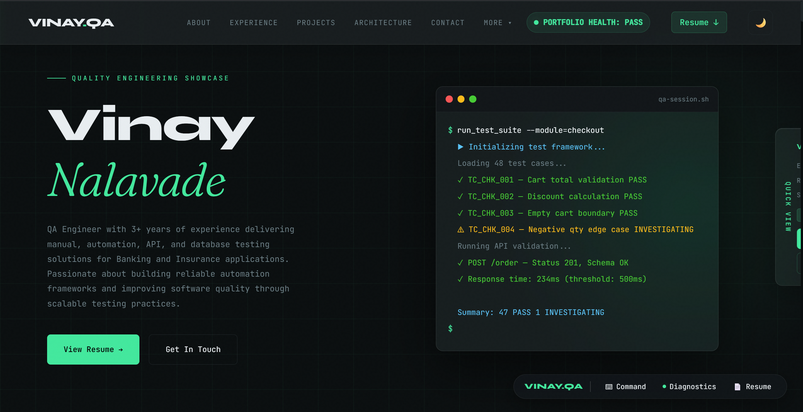

# 🚀 Vinay Nalavade | QA Engineering Portfolio

<p align="center">
  <strong>A modern, interactive portfolio crafted to showcase enterprise QA practices, automation engineering, and software quality through immersive experiences—not just static content.</strong>
</p>

<p align="center">
  <a href="https://vinaynalavade.github.io/vinay-portfolio/"><strong>🌐 Live Portfolio</strong></a>
  •
  <a href="https://github.com/vinaynalavade/vinay-portfolio"><strong>📂 Repository</strong></a>
  •
  <a href="VinayNalavade_Resume.pdf"><strong>📄 Resume</strong></a>
</p>

---

# 📸 Portfolio Preview

<p align="center">
  <a href="https://vinaynalavade.github.io/vinay-portfolio/">
    
  </a>
</p>

---

# ✨ Why This Portfolio?

Most portfolios list skills.

This portfolio demonstrates them.

Built with the mindset of a QA Engineer, it recreates how quality engineering works inside enterprise software teams through interactive architecture, realistic testing scenarios, automation showcases, and domain-driven case studies.

Whether you're a recruiter, hiring manager, or fellow engineer, the goal is simple:

> **Experience how I think as a Quality Engineer—not just what I know.**

---

# 🚀 What You'll Explore

## 🏠 Professional Portfolio

A modern portfolio presenting professional experience, projects, technical expertise, and career journey.

---

## 🏗 Interactive Framework Architecture

Explore an interactive Selenium Automation Framework including:

* DriverFactory
* BaseTest
* Page Object Model
* TestNG Execution Flow
* Utilities
* Reporting
* Framework Lifecycle

Designed to simplify complex automation architecture through visual exploration.

---

## 🐞 Enterprise Defect Investigation

Dive into realistic defect investigations featuring:

* Problem Analysis
* Investigation Process
* Root Cause Analysis
* Resolution Validation
* Lessons Learned

Inspired by real QA workflows across Banking, Insurance, and Retail domains.

---

## 🔌 API Validation Showcase

Discover enterprise API validation concepts including:

* Request & Response Validation
* Status Code Verification
* Business Rule Validation
* SQL Backend Verification
* Authentication Testing
* Regression Strategy

---

## ⚡ Automation Success Stories

Explore automation initiatives demonstrating measurable business impact, including:

* Selenium Automation Framework
* Python-based Validation Automation
* API Automation
* Quality Engineering Practices

---

## 📚 QA Learning Resources

Curated resources for aspiring and experienced QA Engineers covering:

* Manual Testing
* Automation Testing
* Selenium
* SQL
* API Testing
* Java
* QA Interview Preparation

---

# 🛠 Built With

### Frontend

* HTML5
* CSS3
* JavaScript (ES6)

### QA Technologies

* Java
* Selenium WebDriver
* TestNG
* Postman
* SQL
* Python

### Deployment

* Git
* GitHub
* GitHub Pages

---

# 🌟 Portfolio Features

* Responsive Design
* Glassmorphism UI
* Dark / Light Theme
* Interactive Framework Explorer
* Enterprise QA Case Studies
* Automation Showcase
* API Validation Experience
* Resume Preview
* Mobile Navigation
* SEO Optimization
* Accessibility Improvements
* Performance Optimizations

---

# 📂 Repository Structure

```text
vinay-portfolio
│
├── index.html
├── architecture.html
├── resources.html
├── starter-pack.html
├── core-java.html
│
├── style.css
├── script.js
│
├── assets/
│   ├── screenshots/
│   └── images/
│
├── VinayNalavade_Resume.pdf
│
└── README.md
```

---

# 🚀 Current Release

## Version 2.0.0

### Highlights

* Complete responsive redesign
* Modern UI/UX enhancements
* Interactive framework architecture
* Enterprise defect investigations
* API validation showcase
* Automation impact stories
* Performance optimization
* Accessibility improvements
* SEO enhancements

---

# 🔮 Upcoming Features

Version **2.1** is currently in progress.

Planned enhancements include:

* Interactive Jira Ticket Simulation
* Extent Report Viewer
* SQL Query Explorer
* Postman Collection Viewer
* Jenkins Pipeline Visualization
* Automation Execution Dashboard
* CI/CD Workflow Demonstrations

---

# 🔗 Related Project

## QA Automation Framework

Explore my Hybrid Automation Framework built using Java, Selenium WebDriver, TestNG, Maven, and the Page Object Model.

**Repository**

https://github.com/vinaynalavade/qa-automation-framework

---

# 🌐 Experience the Portfolio

The README provides an overview.

The portfolio tells the complete story.

### 👉 Live Portfolio

https://vinaynalavade.github.io/vinay-portfolio/

---

<p align="center">
If you found this project interesting, consider giving it a ⭐.
</p>
